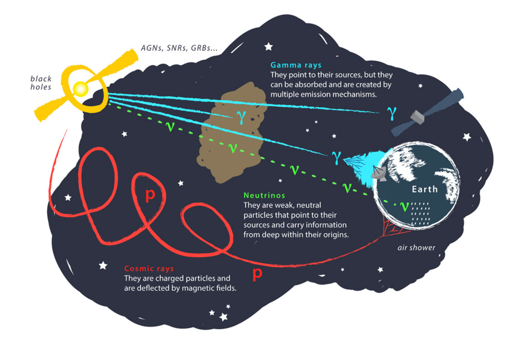
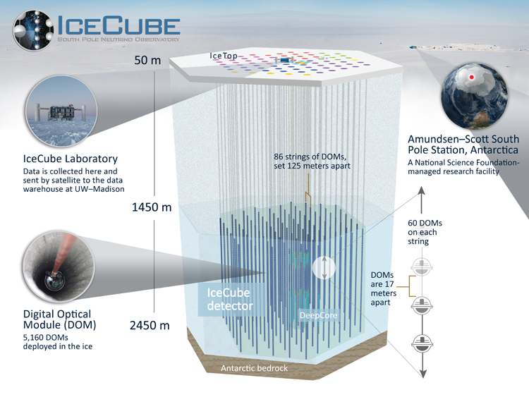
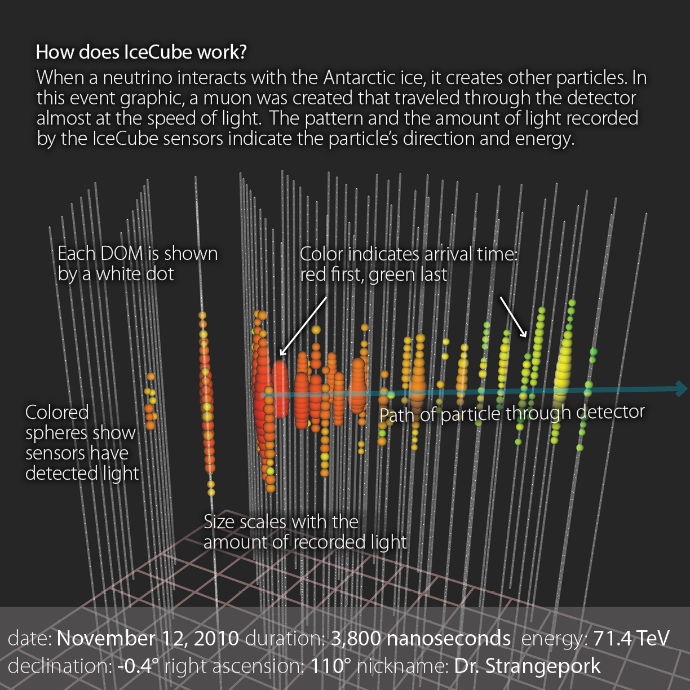
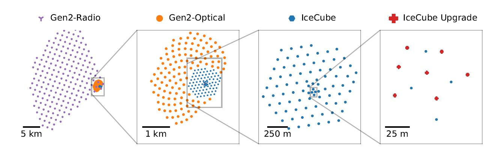
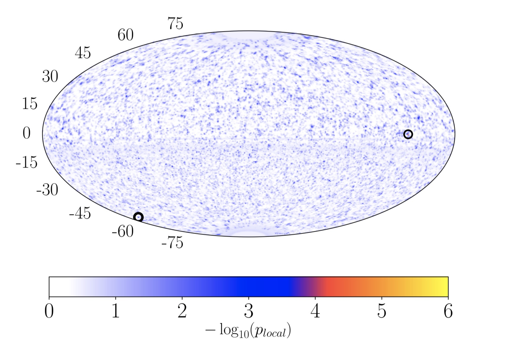
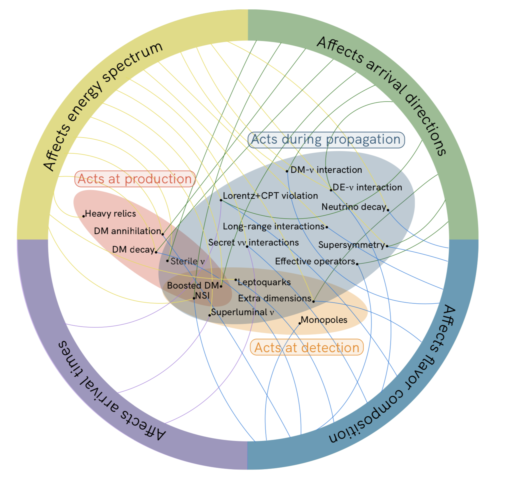

To see the world in a grain of sand And a heaven in a wild flower Hold infinity in the palm of your hand  And eternity in an hour.   ── William Blake; <i>Auguries of Innocence </i>
 
 
 

The main topic of my reasearch is to use the neutrino, a tiny fundamental particle, to understand how the Universe works. I am particularly intrigued by astrophysical neutrinos, as they are a window to the exciting frontier of astrophysics, particle physics and cosmology. I am interested in investigating what we see in experiments, what we can potentially see in experiments and how we can use theory to explain what we see. 
     
 

<!--<figure>
 
<figcaption>
    Messengers from the universe. Image credit: Juan Antonio Aguilar and Jamie Yang, IceCube/WIPAC 
</figcaption>
</figure>
-->

     

<!--

    Messengers from the universe. Image credit: Juan Antonio Aguilar and Jamie Yang, IceCube/WIPAC

-->
Cosmic accelerators are capable of accelerating particles to extremely high energies. We are able to study high-energy astrophysical phenomena by observing signals of messengers coming from the Universe. The messengers are mainly stable particles such as protons, electrons/positrons, photons and neutrinos. Among all these stable particles, neutrinos are neutral, light and weakly interacting. These unique properties give them advantages in astrophysical studies, as they are able to point back to their sources without being deflected by magnetic fields and can exit environments of large matter and radiation densities. Astrophysical neutrinos are able to provide us with access to environments from the nearest sources like the Sun, to the edge of the Universe.

<!--<b>Some topics I am interested and have been working on:</b>
-->
 
 
<b>IceCube</b>
 
The IceCube Neutrino Observatory is a neutrino detector located at the geographical South Pole in Antarctica. It is composed of a cubic kilometer array of digital optical modules embedded deep in the glacial ice. The modules detect high-energy neutrinos by collecting the Cherenkov light emitted when relativistic charged particles produced by neutrino interactions with the ice passing through. IceCube is able to detect neutrinos with energies ranging from ~100 GeV to ~10 PeV which provides us with data to study diverse aspects of physics.  

  

    
  

  

     
  

  

     
  

In the upcoming years, IceCube will be upgraded in several steps. Installation of new strings in the innermost part in IceCube-Upgrade can improve reconstruction of sub-100 GeV events. A 10 times larger version of the array in IceCube-Gen2 can increase the statstics of neutrino events. The radio component can detect events with higher energies where IceCube runs out of sensitivity.      

 
 

  

  
<b>Cosmic Neutrino Sources & Multimessenger Astronomy-</b>
 One important unsolved question is the origin of high-energy astrophysical neutrinos detected by IceCube. Identifying the origin of these neutrinos is of great importance to pinpoint the hadronic interactions in the high-energy Universe thereby unveil the origin of cosmic rays. The isotropic arrival directions of cosmic neutrinos indicate a dominance of extragalactic origin. Hot extragalactic candidates are active galactic nuclei, gamma-ray bursts, star formation galaxies, etc. Galactic origin, as a subdominant component, has candiates such as supernova remnants, X-ray binaries, Galactic gamma ray emitters, etc. A milestone was achieved in 2017 which provided compelling evidence of the correlation between a neutrino event IceCube-170922A and the blazar TXS 0506+056 which is 5.7 billion light-years away from us, in a state of enhanced electromagnetic activity. To have a comprehensive picture of astrophysical sources, we need a multimessenger view for the correlation between messengers. 

  

  

    
    Skymap of local p-values with two most significant locations in Northern and Southern hemisphere in the 10 year IceCube neutrino source search. <a href="https://arxiv.org/abs/1910.08488">[1910.08488]</a>
  
 

 
 

  

  <b>Probe Particle Physics-</b>
Apart from their astronomy aspects, high-energy neutrinos also represent a natural beam for testing the Standard Model and searching for new physics beyond the Standard Model. 
 
For example, search for dark matter. The nature of dark matter remains a mystery but various astrophysical and cosmological observations have showed the evidence of the existence of dark matter. We can identify dark matter indirectly by detecting neutrinos produced by annihilation or decay of dark matter gravitationally concentrated in the halo of galaxies and trapped in heavy celestial objects like the Sun and the Earth. 
(I have been developing a tool, <a href="https://github.com/IceCubeOpenSource/charon" >χarον</a>, which computes neutrino fluxes from dark matter annihilation and decay. This tool is public and I will keep implementing new theoretical ideas to it.) There are a variety of interesting and exciting new physics topics to be tested. The nice figure made by my colleagues on the right provides a good summary.       
  

  

    
    Models of new neutrino physics. <a href="https://arxiv.org/abs/1907.08690">[1907.08690]</a>
  

 
 
Besides IceCube, there is a suite of operating and proposed facilities for the detection of high-energy cosmic neutrinos across different energy ranges based on different detection techniques. Rich data will turn theoretical ideas into testable analyses. We can expect that in the upcoming years more breakthroughs will be made.

 
 
For my publications, please see 
<a href="http://inspirehep.net/search?p=exactauthor%3AQ.R.Liu.1&sf=earliestdate">INSPIRE</a >.

 
 A lot more to be explored... :sparkles: 
